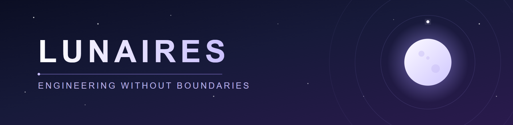
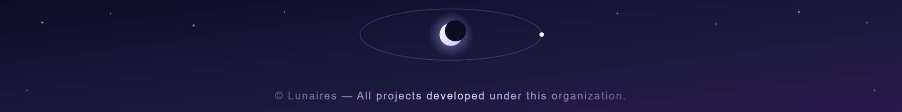

 

  

 

## Who We Are

**Lunaires** is an agile software team that builds end-to-end products across game, web, and mobile/desktop application development without confining itself to a single domain. Every project is handled to the highest standard within its own discipline; design, engineering, and production are carried out under one roof.

 

## What We Believe

<table>
<tr>
<td width="33%" valign="top">

### Domain Independence
We build whatever a project needs — a game engine, a web stack, or a native application, it makes no difference.

</td>
<td width="33%" valign="top">

### End-to-End Ownership
The team maintains the same quality bar at every stage, from design to deployment.

</td>
<td width="33%" valign="top">

### Continuous Growth
Each project is completed with a more mature engineering practice than the last.

</td>
</tr>
</table>

 

## Team

| Member | Role | GitHub |
|---|---|:---:|
| **lightlymoon** | Designer & Full Stack Developer |  |
| **SumTix** | Full Stack Developer |  |

 

## Our Tech Stack

 

## Get In Touch

 

